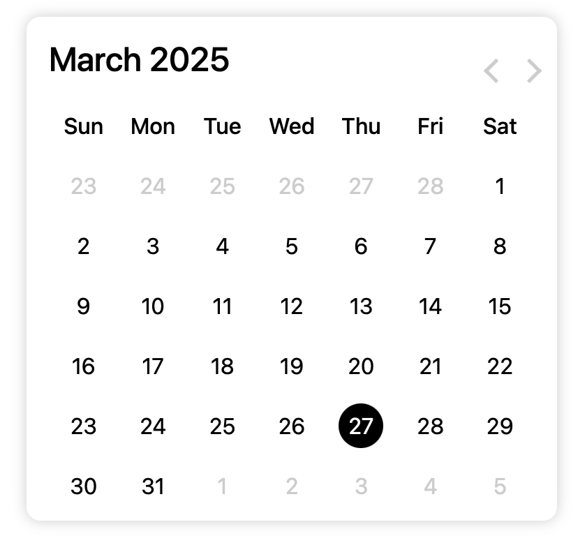

# Booking Calendar




- This repository holds an event-based booking calendar built solely with HTML and CSS for seamless integration into Veto websites. It features custom date/time selection, product/service options, event scheduling, and guest management in a responsive design. All code is strictly protected; unauthorized use, copying, or distribution is prohibited.

## Table of Contents

- [Project Structure](#project-structure)
- [Desired User Flow](#desired-user-flow)
- [User Flow Description (READ)](#user-flow-description-read)
- [Features](#features)
- [Getting Started](#getting-started)
- [Next Steps](#next-steps)

# Project Structure
```
booking-calendar/
├── index.html         # Main HTML file for the booking calendar
├── style.css          # CSS file for styling
├── README.md          # Project description, usage, and integration instructions
└── LICENSE            # Restrictive license (nobody can use or copy)
```

# Desired User Flow
```
                 +-----------------+
                 |   Start Booking |
                 +--------+--------+
                          |
                          v
                 +-----------------+
                 |  Pick a Date    |
                 +--------+--------+
                          |
                          v
         +-------------------------------+
         |      Fill Out Form:           |
         |  - First Name                 |
         |  - Last Name                  |
         |  - Phone Number               |
         |  - # of Guests                |
         |  - Canvas Size (M/L)          |
         +---------------+---------------+
                         |
                         v
         +---------------------------------------+
         | Decision: Are All Fields Completed    |
 ----->  |         AND Guest Count >= 20?        |
 |       +---------------+---------------+-------+
 |                        |               |
 |                     NO |               | YES
 |                        v               v
 |                +----------------+  +----------------------------+
 |                |  Show Error:   |  | Confirm All Selections     |
 |                |"Incomplete     |  +-------------+--------------+
 |                |  Guest < 20"   |                |
 |                +----------------+                v
 |                        |                 +----------------------+
 |                        |                 | Choose Painting via  |
 |                        |                 | Wix Slider Gallery   |
 |                        |                 | API                  |
 |                        |                 +-----------+----------+
 |                        |                             |
 ------------------------+                              |
                                                        |
                                                        v
                                         +----------------------+
                                         | Checkout with Stripe |
                                         +-----------+----------+
                                                     |
                                                     v
                                         +----------------------+
                                         | Decision: Payment    |
                                         | Successful?          |
                                         +------+-------+-------+
                                                | NO           | YES
                                                v              v
                                         +-----------------+  +-----------------------+
                                         | Show Payment    |  | Send Confirmation and |
                                         | Error & Retry   |  | Receipt to User Email |
                                         +-----------------+  +-----------+-----------+
                                                                      |
                                                                      v
                                                           +------------------+
                                                           | Send Data to Wix |
                                                           +--------+---------+
                                                                    |
                                                                    v
                                                           +------------------+
                                                           |     Complete     |
                                                           +------------------+

```

# User Flow Description (READ)
1. Start Booking:
   - The user initiates the booking process.
2. Pick a Date:
   - The user selects a desired date from the calendar.
3.	Form Slides Up:
   - After a date is chosen, the booking form slides up into view to indicate that further input is required.
4.	Fill Out Form:
   - The user completes the form by entering:
	   - First Name
	   - Last Name
	   - Phone Number
	   - Number of Guests
	   - Canvas Size (M/L)
5.	Retrieve Data from Wix API:
   - Data for pricing and available options (e.g., canvas sizes and corresponding prices) is fetched from the Wix API, ensuring that the latest options and pricing are displayed to the user.
6.	Validate Form and Guest Count:
   - A decision point verifies that all required fields are filled out and that the guest count is at least 20.
	- If validation fails:
      - An error (“Incomplete or Guest < 20”) is shown, and the process returns to the form for correction.
	   - If validation passes: The process continues.
7.	Confirm Selections:
   - The user reviews and confirms all their selections, including the chosen date, form entries, and available options (with pricing data from the Wix API).
8.	Calculate Price:
   - The system calculates the total price by multiplying the number of guests by the canvas price (which is determined by the selected canvas size).
   - This calculation is based on the dynamic pricing data retrieved from the Wix API.
9.	Choose Painting:
   - The user selects a painting via the Wix Slider Gallery API.
10. Checkout with Stripe:
   - The user proceeds to the checkout process, where the calculated total price is charged through Stripe.
11. Payment Validation:
   - A decision point checks if the payment was successful:
	- If unsuccessful: A payment error is displayed, allowing the user to retry the payment.
	- If successful: The process moves forward.
12. Send Confirmation and Receipt:
   - Once payment is confirmed, a confirmation and receipt are sent to the customer’s email.
13. Send Data to Wix:
   - Booking details, including user data and pricing information, are transmitted to Wix for record keeping
     
# Features

- **Responsive Design:** Optimized for desktop and mobile devices.
- **Simple Integration:** Built solely with HTML and CSS, making it easy to integrate into your website using Veto.
- **Custom Date and Time Selection:** Allows users to select specific dates and times.
- **Product/Service Selection:** Users can choose a type of product or service during the booking.
- **Event Integration:** Supports booking events with various options.
- **Guest Management:** Option to add the number of guests during the booking process.

# Getting Started

1. **Clone the Repository:**
```
   bash
   git clone https://github.com/yourusername/booking-calendar.git
```
Since the project only uses HTML and CSS, integrate it directly into your WIX Website using Velo without needing additional scripts:
```
<!-- Link the CSS file -->
<link rel="stylesheet" href="path/to/style.css">

<!-- Embed the booking calendar HTML -->
<div class="booking-calendar">
  <!-- Insert your calendar HTML here -->
</div>
```

# Next Steps

- ## Integrate the HTML & CSS:
1. Embed the booking calendar’s HTML code into a custom element on the Wix site.
2. Link the CSS file through the Wix Editor or Velo’s asset management system to ensure proper styling.
- ## Set Up the Wix Database:
3. Create a new database collection on the Wix site to store all booking data.
4. Define the necessary fields (e.g., date, time, service type, guest count) based on project requirements.
- ## Connect via Wix Velo API:
5. Utilize Wix Velo’s API (such as wix-data) to manage interactions between the booking calendar and the database.
6. Implement logic to capture booking form data and perform the required CRUD operations on the database.
- ## Test the Integration:
7. Verify that all form inputs from the booking calendar are captured correctly.
8. Ensure data is successfully inserted into and retrieved from the Wix database.
9. Debug any issues related to data flow or API interactions.
- ## Finalize and Deploy:
10. Once testing is complete and functionality is confirmed, finalize the integration.
11.  Deploy the updated Wix site with the integrated booking calendar and connected database.
- ## Documentation & Handover:
12. Update the project documentation with relevant configuration details and instructions for future maintenance.
13. Communicate all necessary information with me
